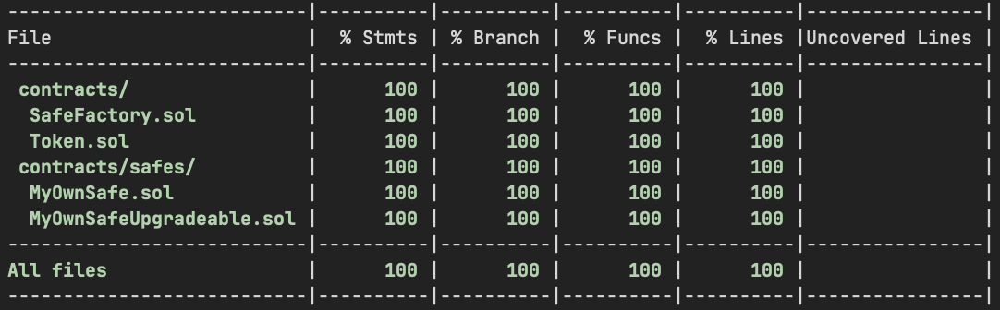

# Lab 5

> https://bdaf.notion.site/Lab5-Factory-Pattern-dc57d9dd8f5c472ab21ca190ec0b7189

## Getting Started

Please refer to [lab4/README.md](https://github.com/tmp54/blockchain-development-and-fintech/blob/master/lab4/README.md#getting-started)

## Coverage

```
---------------------------|----------|----------|----------|----------|----------------|
File                       |  % Stmts | % Branch |  % Funcs |  % Lines |Uncovered Lines |
---------------------------|----------|----------|----------|----------|----------------|
 contracts/                |      100 |      100 |      100 |      100 |                |
  SafeFactory.sol          |      100 |      100 |      100 |      100 |                |
  Token.sol                |      100 |      100 |      100 |      100 |                |
 contracts/safes/          |      100 |      100 |      100 |      100 |                |
  MyOwnSafe.sol            |      100 |      100 |      100 |      100 |                |
  MyOwnSafeUpgradeable.sol |      100 |      100 |      100 |      100 |                |
---------------------------|----------|----------|----------|----------|----------------|
All files                  |      100 |      100 |      100 |      100 |                |
---------------------------|----------|----------|----------|----------|----------------|
```



## Gas Report

```
······························································································································
|  Solidity and Network Configuration                                                                                        │
·········································|·················|···············|·················|································
|  Solidity: 0.8.24                      ·  Optim: false   ·  Runs: 200    ·  viaIR: false   ·     Block: 30,000,000 gas     │
·········································|·················|···············|·················|································
|  Methods                                                                                                                   │
·········································|·················|···············|·················|················|···············
|  Contracts / Methods                   ·  Min            ·  Max          ·  Avg            ·  # calls       ·  usd (avg)   │
·········································|·················|···············|·················|················|···············
|  MyOwnSafe                             ·                                                                                   │
·········································|·················|···············|·················|················|···············
|      count                             ·         45,610  ·       48,273  ·         46,675  ·            15  ·           -  │
·········································|·················|···············|·················|················|···············
|      withdraw                          ·         53,496  ·       56,193  ·         54,575  ·            15  ·           -  │
·········································|·················|···············|·················|················|···············
|  MyOwnSafeUpgradeable                  ·                                                                                   │
·········································|·················|···············|·················|················|···············
|      count                             ·              -  ·            -  ·         45,610  ·             3  ·           -  │
·········································|·················|···············|·················|················|···············
|      initialize                        ·              -  ·            -  ·         66,399  ·             1  ·           -  │
·········································|·················|···············|·················|················|···············
|      withdraw                          ·              -  ·            -  ·         53,518  ·             3  ·           -  │
·········································|·················|···············|·················|················|···············
|  SafeFactory                           ·                                                                                   │
·········································|·················|···············|·················|················|···············
|      deploySafe                        ·              -  ·            -  ·        344,914  ·             4  ·           -  │
·········································|·················|···············|·················|················|···············
|      deploySafeUpgradeable             ·              -  ·            -  ·        112,855  ·             4  ·           -  │
·········································|·················|···············|·················|················|···············
|      deploySafeUpgradeableWithCreate2  ·              -  ·            -  ·        113,604  ·             4  ·           -  │
·········································|·················|···············|·················|················|···············
|      deploySafeWithCreate2             ·              -  ·            -  ·        350,807  ·             4  ·           -  │
·········································|·················|···············|·················|················|···············
|  Token                                 ·                                                                                   │
·········································|·················|···············|·················|················|···············
|      mint                              ·              -  ·            -  ·         68,899  ·            12  ·           -  │
·········································|·················|···············|·················|················|···············
|  Deployments                                             ·                                 ·  % of limit    ·              │
·········································|·················|···············|·················|················|···············
|  MyOwnSafe                             ·              -  ·            -  ·        365,525  ·         1.2 %  ·           -  │
·········································|·················|···············|·················|················|···············
|  MyOwnSafeUpgradeable                  ·              -  ·            -  ·        417,282  ·         1.4 %  ·           -  │
·········································|·················|···············|·················|················|···············
|  SafeFactory                           ·        894,559  ·      894,571  ·        894,561  ·           3 %  ·           -  │
·········································|·················|···············|·················|················|···············
|  Token                                 ·              -  ·            -  ·        941,569  ·         3.1 %  ·           -  │
·········································|·················|···············|·················|················|···············
|  Key                                                                                                                       │
······························································································································
|  ◯  Execution gas for this method does not include intrinsic gas overhead                                                  │
······························································································································
|  △  Cost was non-zero but below the precision setting for the currency display (see options)                               │
······························································································································
|  Toolchain:  hardhat                                                                                                       │
······························································································································
```


